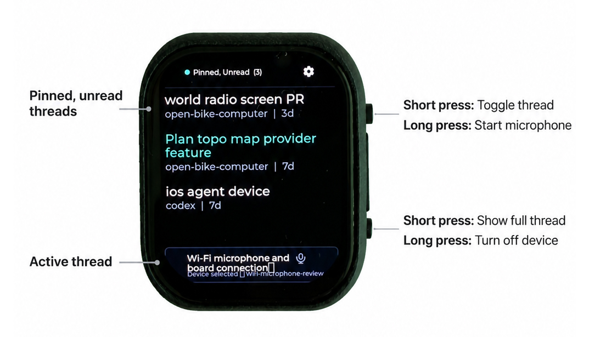

# Codex Microphone

A compact Codex Desktop companion for the Waveshare ESP32-S3-Touch-AMOLED-2.06.
It shows unread and pinned attention threads and turns the board into a
privacy-gated USB or paired Wi-Fi microphone for the selected task.

The GitHub repository is `seichris/codex-microphone`; the local folder and
Codex project intentionally remain `codex-esp32-display` so existing threads
continue to use the same local project.

## Controls

- **Upper button — short press:** move to the next thread.
- **Lower button — short press:** open the selected thread; press again to return.
- **Either button — hold for one second:** focus the selected thread and start
  dictation; hold again to stop. The Mac companion opens the draft in that task.
- **Touch:** scroll, open cards, select Voice Target, and adjust display settings.
- **Lower button — longer hardware hold:** power off the board.



## Get started

- **Prerequisites:** macOS with Codex Desktop or CLI, Node.js 18.18+, and
  ESP-IDF 5.4 or newer.
- **Start the bridge:** clone into the existing local name, then run:

  ```bash
  git clone https://github.com/seichris/codex-microphone.git codex-esp32-display
  cd codex-esp32-display/bridge
  npm run setup
  npm start
  ```

- **Flash the board:** run `idf.py set-target esp32s3` and `idf.py menuconfig`
  in `firmware`, set Wi-Fi, the bridge attention endpoint, and bearer token,
  then run `idf.py build` and `idf.py -p /dev/cu.usbmodemXXXX flash monitor`.
- **Enable paired Wi-Fi dictation (optional):** create and provision a pairing
  bundle with the scripts described in [macOS pairing instructions](macos/README.md#pairing-the-wi-fi-microphone).
- **Run the Mac companion (optional):** use `./macos/build_app.sh`, open the
  generated app, and grant Speech Recognition permission (plus Microphone for USB mode).

Detailed implementation, architecture, API, security, and validation notes are in
[Current software](docs/current-software.md). The [device protocol](docs/protocol.md)
and [architecture notes](docs/architecture.md) remain available as references.
